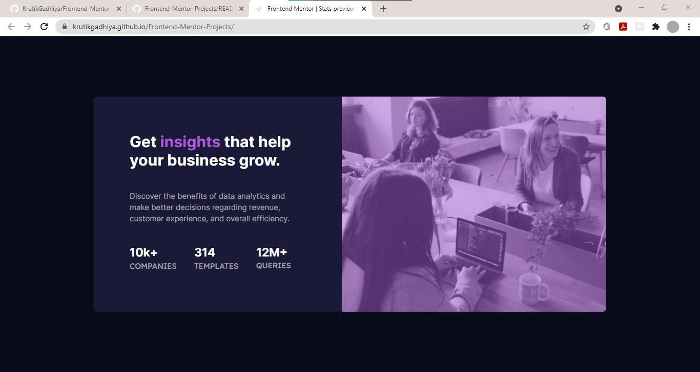

# Frontend Mentor - Stats preview card component solution

This is a solution to the [Stats preview card component challenge on Frontend Mentor](https://www.frontendmentor.io/challenges/stats-preview-card-component-8JqbgoU62). Frontend Mentor challenges help you improve your coding skills by building realistic projects. 

## Table of contents

- [Overview](#overview)
  - [The challenge](#the-challenge)
  - [Screenshot](#screenshot)
  - [Links](#links)
- [My process](#my-process)
  - [Built with](#built-with)
  - [What I learned](#what-i-learned)
  - [Continued development](#continued-development)
  - [Useful resources](#useful-resources)
- [Author](#author)
- [Acknowledgments](#acknowledgments)

**Note: Delete this note and update the table of contents based on what sections you keep.**

## Overview

### The challenge

Users should be able to:

- View the optimal layout depending on their device's screen size

### Screenshot



Add a screenshot of your solution. The easiest way to do this is to use Firefox to view your project, right-click the page and select "Take a Screenshot". You can choose either a full-height screenshot or a cropped one based on how long the page is. If it's very long, it might be best to crop it.

Alternatively, you can use a tool like [FireShot](https://getfireshot.com/) to take the screenshot. FireShot has a free option, so you don't need to purchase it. 

Then crop/optimize/edit your image however you like, add it to your project, and update the file path in the image above.

**Note: Delete this note and the paragraphs above when you add your screenshot. If you prefer not to add a screenshot, feel free to remove this entire section.**

### Links

- Solution URL: [solution URL](https://github.com/KrutikGadhiya/Frontend-Mentor-Projects/tree/stats-preview-card-component-main)
- Live Site URL: [live site URL](https://krutikgadhiya.github.io/Frontend-Mentor-Projects/)

## My process

### Built with

- Semantic HTML5 markup
- CSS custom properties
- Flexbox

### What I learned

it was my first time to use variables in css it is a very good idea as you can declare the variables at one place and use that in the whole document, it really simplifies the work where the same color, size etc. are used frequently.
i am also inspired with the flex boxes as it is also very fun to work with. i almost use flex box in every project

```css
:root {
  /* Primary Color */
  --very-dark-blue: hsl(233, 47%, 7%);
  --dark-desaturated-blue: hsl(244, 38%, 16%);
  --soft-violet: hsl(277, 64%, 61%);

  /* Neutral Color */
  --white: hsl(0, 0%, 100%);
  --slightly-transperent-white-1: hsla(0, 0%, 100%, 0.75);
  --slightly-transperent-white-2: hsla(0, 0%, 100%, 0.6);
}
.container {
  height: 130%;
  margin-top: 100%;
  flex-direction: column-reverse;
  justify-content: center;
  align-items: center;
}
```

### Continued development

i want to make the bellow code more simple where i have used height and margin-top for the mobile view.

```css
.container {
  height: 130%;
  margin-top: 100%;
  flex-direction: column-reverse;
  justify-content: center;
  align-items: center;
}
```

### Useful resources

- [opacity of the image](https://www.w3schools.com/css/css_image_transparency.asp) - This helped me for changing the opacity of the image.

## Author

- Website - [krutik](https://github.com/KrutikGadhiya/)
- Frontend Mentor - [@KrutikGadhiya](https://www.frontendmentor.io/profile/KrutikGadhiya)
- Twitter - [@KrutikGadhiya](https://twitter.com/KrutikGadhiya)


## Acknowledgments

w3schools, youtube was my best acknowledgements for this project.
